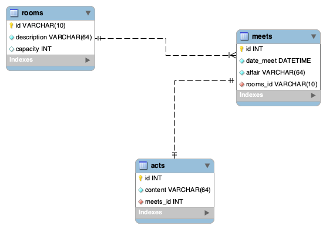
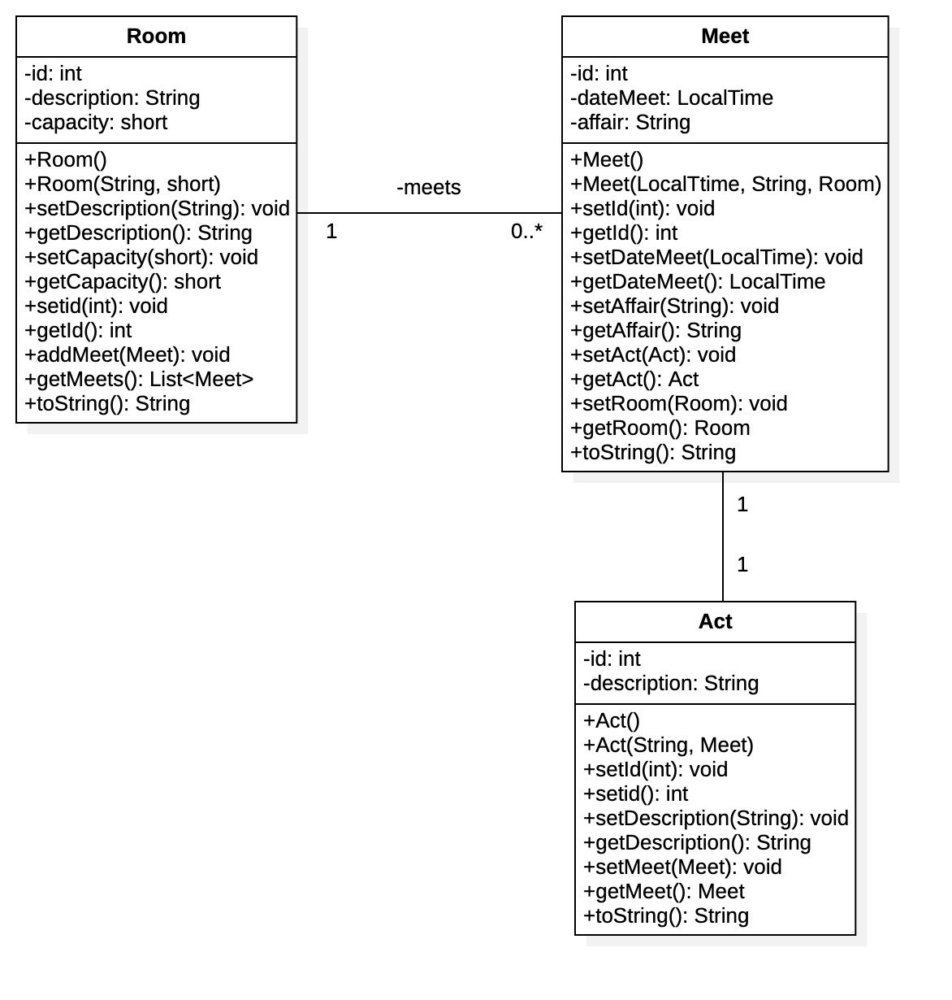

# Persistencia con JPA

Proyecto que persiste entidades en una base de datos de MySQL a través de anotaciones de Java, y usando Hibernate como ORM

## Herramientas Usadas.

- Jakarta
- JDK Versión 17
- Hibernate 5.6
- JDBC de MySQL 8.0.30
- Maven como gestor de dependencias

## Contexto

El dominio del problema es la gestión de reuniones que se lllevan a cabo en una sala y que tienen un acta.

## Modelo Relacional

## Modelo de Objetos

